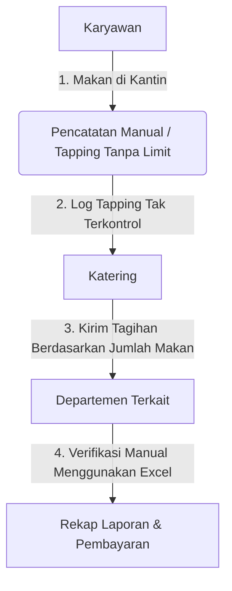
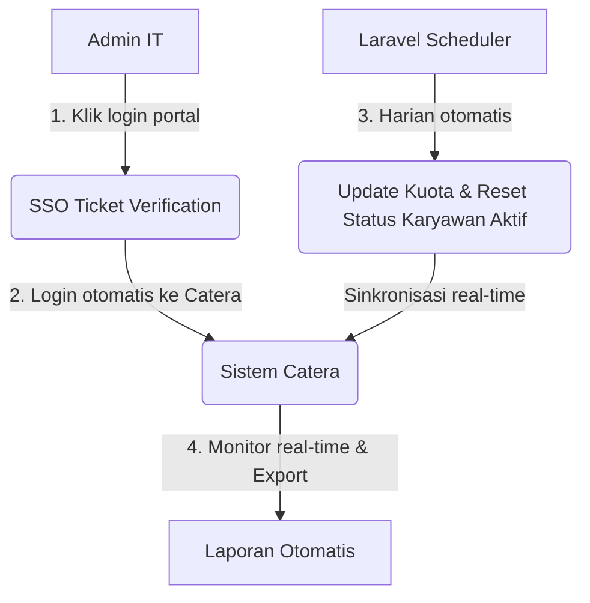

<div align="center">
    
    <h1 align="center">Lunch Management System (Catera)</h1>
    <p align="center">
        A modern enterprise application for managing employee lunch quotas, built with Laravel 12, Livewire 4, and Flux UI.
    </p>
</div>

---

## 📖 1. Pendahuluan

**Catera (Lunch Management System)** adalah platform manajemen akses kantin berbasis UUID (RFID/NFC). Sistem ini memantau tapping kartu karyawan, memisahkan data kartu resmi (`Authorized`) dan kartu anonim (`Unauthorized`), serta menjadwalkan penambahan kuota makan otomatis.

---

## 👥 2. Pengguna & Deskripsi Proyek (IT Departemen)

Proyek ini dirancang khusus untuk digunakan oleh **Tim IT (Administrator)** guna mengelola hak akses kantin karyawan. IT dapat memantau log tapping secara real-time, mendaftarkan kartu anonim, mengelola grup pengguna, mengatur penjadwalan kuota, serta mengontrol hak akses aplikasi melalui modul permission terintegrasi.

---

## ❓ 3. Rumusan Masalah

Sebelum adanya Catera, sistem login dan data karyawan terpisah-pisah di berbagai aplikasi internal:
- **Autentikasi Terfragmentasi**: Setiap sistem memerlukan kredensial login tersendiri, menyulitkan pengelolaan akun oleh IT.
- **Penyimpanan Data Tersebar**: Database karyawan dan database akses kartu kantin tidak sinkron, menyebabkan duplikasi data dan potensi kebocoran hak akses.
- **Manajemen Kuota Manual**: Penyetelan kuota makan karyawan memerlukan intervensi manual setiap hari, meningkatkan risiko kesalahan manusia.

---

## 💡 4. Solusi yang Diberikan

Catera mengatasi masalah tersebut dengan menyediakan:
- **Integrasi SSO (Single Sign-On)**: Verifikasi login langsung terhubung dengan database tiket SSO portal utama (`portal_application.sso_tickets`), menyatukan sesi autentikasi.
- **Database Terpusat**: Berbagi skema database (`portal_application` untuk data user/SSO dan `catera` untuk manajemen kuota makan), memastikan data user selalu sinkron dengan status aktif/nonaktif karyawan secara real-time.
- **Otomatisasi Penjadwalan (Scheduler)**: Eksekusi otomatis untuk reset kuota harian, penambahan kuota terjadwal, dan pembersihan log sukses via Laravel Scheduler.

---

## 📊 5. Perbandingan Alur Bisnis (Business Flow)

Berikut adalah gambaran alur bisnis sistem sebelum (*As-Is*) dan sesudah (*To-Be*) menggunakan Catera.

### Alur Sebelum Catera (As-Is)
Sistem belum ada. Proses pencatatan manual, tidak ada limitasi kuota makan karyawan, dan koordinasi dengan katering dilakukan langsung tanpa sistem kontrol.



### Alur Sesudah Catera (To-Be)
Proses login terpusat melalui SSO dan sinkronisasi kuota makan berjalan otomatis via sistem scheduler.



---

## 🛠️ 6. Teknologi yang Digunakan

Aplikasi ini dibangun menggunakan ekosistem modern:
- **Backend & Framework**: PHP 8.2+ & Laravel 12.0
- **Frontend & Reactivity**: Livewire 4.0 & Alpine.js
- **UI Library**: Flux UI 2.9 (Free Edition) & Tailwind CSS v4
- **Autentikasi**: Laravel Fortify & Custom SSO Integration
- **Role & Permission**: Spatie Laravel-Permission 7.4
- **Database**: PostgreSQL (dengan skema multi-tenant/shared DB `portal_application` & `catera`)
- **Containerization**: Laravel Sail (Docker)
- **Testing**: Pest PHP 4.4

---

## 🚀 7. Panduan Instalasi (Development dengan Docker Sail)

### 1. Persiapan Awal
Kloning repositori dan masuk ke folder project:
```bash
git clone <url-repo> catera-web
cd catera-web
```

### 2. Konfigurasi Environment
Salin file `.env.example` menjadi `.env`:
```bash
cp .env.example .env
```

### 3. Instalasi Dependensi PHP
Jalankan composer melalui Docker Sail temporer untuk mengunduh package:
```bash
docker run --rm \
    -u "$(id -u):$(id -g)" \
    -v "$(pwd):/var/www/html" \
    -w /var/www/html \
    laravelsail/php84-composer:latest \
    composer install --ignore-platform-reqs
```

### 4. Menjalankan Docker Container
Jalankan kontainer dengan Sail:
```bash
./vendor/bin/sail up -d
```

### 5. Inisialisasi Aplikasi
Generate application key dan jalankan migrasi database beserta seeder:
```bash
./vendor/bin/sail artisan key:generate
./vendor/bin/sail artisan migrate --seed
```

### 6. Instalasi & Kompilasi Aset Frontend
Install library node dan lakukan compile aset:
```bash
./vendor/bin/sail npm install
./vendor/bin/sail npm run build
```

Aplikasi sekarang dapat diakses melalui: **http://localhost:81** (sesuai port pada `.env`).

---

## 💡 Masukan Tambahan untuk Pengembangan

Untuk meningkatkan keandalan sistem, hal-hal berikut sangat disarankan untuk dimasukkan dalam dokumentasi / konfigurasi:
1. **Konfigurasi Webhook Sync Permission**: Sistem memiliki endpoint `/catera/api/webhook/clear-permission-cache` yang dipicu dari portal utama ketika ada perubahan role/permission. Pastikan `X-Secret-Token` di `.env` dikonfigurasi sama dengan token pengirim.
2. **Scheduler Daemon**: Pastikan `artisan schedule:work` (lokal) atau cron job `* * * * * cd /path-to-your-project && php artisan schedule:run >> /dev/null 2>&1` (produksi) aktif agar fitur reset kuota otomatis berjalan.
3. **SSO Portal URL**: Nilai `SSO_PORTAL_URL` di `.env` harus mengarah ke URL portal utama yang valid untuk menangani kegagalan tiket atau proses logout.
