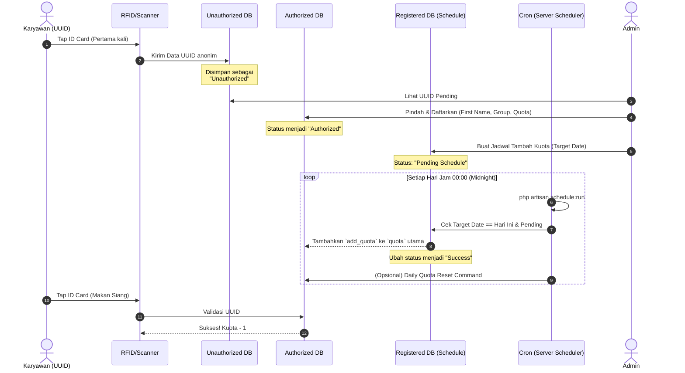

<div align="center">
    
    <h1 align="center">Lunch Management System (Catera)</h1>
    <p align="center">
        A modern enterprise application for managing employee lunch quotas, authorization lists, and scheduled quota updates via headless or monolithic integration. Built with Laravel 11.
    </p>
</div>

---

## 📖 Deskripsi Proyek

**Catera (Lunch Management System)** dirancang khusus untuk mengelola akses kantin atau fasilitas makan siang berbasis UUID (misal: ID Card RFID/NFC). Sistem memisahkan entri mesin atau pengguna ke dalam dua kelompok: `Unauthorized` (belum dikenali) dan `Authorized` (sudah didaftarkan). Administrator dapat dengan mudah mengatur kelompok, kuota dasar, serta menjadwalkan penambahan kuota di tanggal tertentu menggunakan fitur _Scheduled Added Quota (Registered)_.

Menerapkan best-practices optimasi sistem seperti:

- **Lazy Loading & Debounce** pada input ribuan UUID untuk meringankan _load_ tabel backend.
- **Full-Text B-Tree Native Database Indexing** guna mendukung eksekusi kueri ultra-cepat.
- **Cron-Job Scheduler** Laravel murni tanpa supervisor tambahan untuk mengOtomatisasi Reset & Registrasi harian.

---

## ⚙️ Mekanisme Alur Kerja Sistem

Sistem beroperasi berdasarkan status UUID yang terdeteksi, dengan penjadwalan (_background process_) yang akan otomatis mengeksekusi penambahan kuota atau reset harian.



---

## 💻 Persyaratan Sistem

Sebelum melakukan instalasi, pastikan server Anda telah memenuhi persyaratan berikut:

- **PHP** >= 8.2
- **Composer** v2.x
- **MySQL** >= 8.0 (atau PostgreSQL >= 13) dengan dukungan Full-Text Search.
- **Node.js** >= 18 & NPM (untuk aset frontend/Livewire/FluxUI)
- Akses terminal Linux atau sistem berbasis Unix (untuk Cron Job).

---

## 🚀 Panduan Instalasi (Development / Local)

1. **Kloning Repositori**

    ```bash
    git clone <url-repo-anda> catera
    cd catera
    ```

2. **Install Dependensi Backend (PHP)**

    ```bash
    composer install
    ```

3. **Install Dependensi Frontend (Node.js)**

    ```bash
    npm install
    npm run build
    ```

4. **Konfigurasi Environment**

    ```bash
    cp .env.example .env
    php artisan key:generate
    ```

    _Buka file `.env` dan atur koneksi `DB_DATABASE`, `DB_USERNAME`, dan `DB_PASSWORD` sesuai dengan server lokal Anda._

5. **Jalankan Migrasi & Seeder**
   Sistem butuh struktur tabel untuk Authorized/Unauthorized:

    ```bash
    php artisan migrate --seed
    ```

    _(Opsional: Jalankan seeder khusus dummy data jika tersedia)._

6. **Jalankan Development Server**
    ```bash
    php artisan serve
    ```

---

## ⏳ Menjalankan Scheduler

Terdapat dua opsi untuk menjalankan _scheduler_ sistem yang mengatur penambahan kuota harian dan reset otomatis:

### Opsi 1: Menjalankan Scheduler Secara Lokal / Terminal (Development)

Saat proses pengembangan atau testing, Anda bisa menjalankan _scheduler daemon_ yang disertakan di Laravel 11. Cukup jalankan perintah ini dari terminal Anda dan biarkan ia tetap berjalan (_listen_ setiap menit):

```bash
php artisan schedule:work
```

### Opsi 2: Instalasi via Cron Job (Server Production)

Pada lingkungan Production, jadwal (_background process_) dieksekusi oleh Server _cron daemon_ sehingga Anda tidak perlu membiarkan terminal terbuka terus-menerus.

1. Login ke server anda via SSH.
2. Buka editor Cron dengan mengeksekusi perintah berikut:
    ```bash
    crontab -e
    ```
3. Tambahkan baris kode ini di paling bawah (pastikan mengubah `/path/to/catera` dengan alamat instalasi asli atau absolute path Laravel di server Anda):
    ```bash
    * * * * * cd /path/to/catera && php artisan schedule:run >> /dev/null 2>&1
    ```
4. Simpan dan Keluar. Cron akan memanggil instruksi Laravel setiap 1 menit.

---

## 🎨 Teknologi & Libraries Pendukung

- **Framework**: Laravel 11.x
- **UI & Frontend reactivity**: Livewire v3 + Alpine.js
- **Komponen UI library**: Flux UI Free (Tailwind CSS based)
- **Database**: Eloquent ORM + Native Database level validation
- **Diagrams**: Mermaid JS

---

_Dibuat untuk Manajemen Praktis di Lingkungan F&B / Catera - Enterprise._
